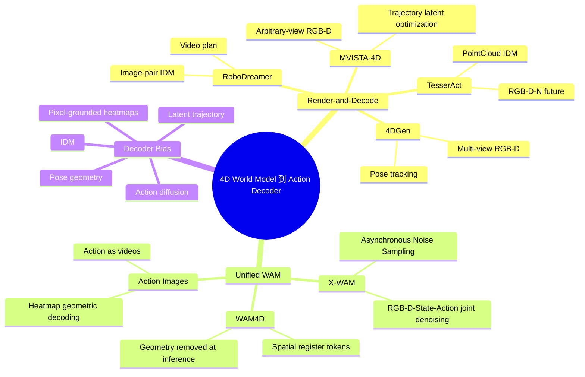

# 4d_world_model_action_decoder_report-4D World Model 到 Action Decoder 相关工作调研

本报告梳理机器人 4D 世界模型如何进入动作解码路径，重点比较 inverse dynamics、pose tracking、trajectory latent optimization、joint action denoising、training-time geometry supervision 与 action-image bottleneck。

- 调研日期：2026-06-30
- 范围：2023-2026
- 输出：相关工作谱系 + 研究建议
- 验证：arXiv / OpenReview / PMLR / 项目页

## 1. 核心结论

> **结论 1** 相关工作的关键分歧不是 “是否生成 4D”，而是生成的 future 如何成为 action-facing signal。
> 

> **结论 2** 4D geometry 能改善空间、遮挡和接触推理，但 dense 4D reconstruction 会带来延迟和误差传播。
> 

> **结论 3** 经典 inverse dynamics 是最常见接口，但 MVISTA-4D 等工作指出它对多解动作存在 ill-posed 风险。
> 

> **结论 4** 低算力场景下，最有希望的切入点是轻量 geometry-to-action-image decoder，而不是完整复现 X-WAM/WAM4D。
> 

> **推荐方向：**Geometry-Grounded Action Images，将 TesserAct 风格 RGB-D-N / 4D future 转成 ActionImages 风格多视角 action heatmaps，再通过几何解码恢复 7-DoF action。
> 

## 2. 问题定义

给定当前观测 `o_0` 和语言目标 `l`，4D world model 预测未来世界：

```
future = W(o_0, l)
```

Action decoder 要把未来世界转为动作序列：

```
a_{0:T-1} = D(o_0, future, l, s_0)
```

困难在于：相同或相近的视觉/几何变化可能由多个动作产生。遮挡、接触、部分可观测、gripper state 和相机视角都会让 `future -> action` 变成多解问题。因此相关工作实际是在为 `D` 加不同 inductive bias。

> World Action Models survey 给出的边界很有用：WAM 不是简单 video generator 加 action head，而是 predicted future 必须参与 produce、score 或 train action path。
> 

## 3. 技术谱系



## 4. 代表工作深挖

### RoboDreamer: video plan + inverse dynamics

RoboDreamer 用 text-to-video/compositional world model 生成未来 video plan，再使用 inverse dynamics model 从相邻生成帧预测动作。它提供了 “先想象，再解码动作” 的早期基线，但 future 主要是 2D RGB，缺少 manipulation 所需的深度、接触和 6-DoF 空间约束。

### TesserAct: RGB-D-N future + PointNet IDM

TesserAct 生成 RGB、Depth、Normal 视频，并把它们重建成 4D scene/point cloud。动作解码器使用 PointNet 编码当前和预测未来 4D point cloud，结合文本 embedding，经 MLP 输出 7-DoF action。它是本题最直接的基线。

### 4DGen: multi-view geometry + pose tracking

4DGen 通过 cross-view pointmap alignment 生成几何一致的 multi-view RGB-D/pointmap future，然后使用 off-the-shelf 6-DoF pose tracker 恢复 end-effector trajectory。优点是可解释、训练成本低；风险是 pose tracking 对遮挡、contact 和生成伪影敏感。

### MVISTA-4D: trajectory latent optimization + residual IDM

MVISTA-4D 明确指出 classic IDM 是 ill-posed：多种动作可能解释相似视觉变化。它用低维 trajectory latent 表示整段动作，在测试时通过反向传播优化该 latent，使生成 future 与目标 future 匹配，再用 residual IDM 修正执行细节。

### X-WAM: unified 4D world-action denoising

X-WAM 在统一 diffusion sequence 中预测 future RGB video、depth video、states 和 actions。动作通过 MLP 投影为 latent token，再 denoise 后解码回物理空间。Asynchronous Noise Sampling 让动作只用较少 denoising steps 快速输出，视频继续 denoise 以保持高质量 4D reconstruction。

### WAM4D: training-time geometry, lightweight inference

WAM4D 不强制推理时生成 dense 4D geometry，而是用 spatial register tokens 在训练时读取 future depth，让 depth loss 反传并塑造 action-relevant video features。部署时移除 registers、depth blocks 和 geometry head，保留轻量 observation-to-action path。

### Action Images: action as pixel-grounded videos

Action Images 把 7-DoF action 转换成 position、normal、up 三个语义 3D 点，再投影成多视角 RGB Gaussian heatmaps/action videos。生成后，通过主视角 ray casting 和侧视角 heatmap matching 恢复 3D semantic points，再解码回 7-DoF action。

## 5. 对比矩阵

| 路线 | 代表工作 | Future 表征 | Action Decoder | 可解释性 | 推理成本 | 低算力可行性 | 主要风险 |
| --- | --- | --- | --- | --- | --- | --- | --- |
| 2D video + IDM | RoboDreamer | RGB video plan | frame-pair IDM | 低 | 中 | 中 | 缺少几何，IDM 多解 |
| 4D scene + IDM | TesserAct | RGB-D-N / point cloud | PointNet + MLP | 中 | 中 | 高 | 重建误差，per-step IDM ill-posed |
| 4D future + pose tracker | 4DGen | multi-view RGB-D / pointmap | 6-DoF pose tracking | 高 | 中 | 中高 | 遮挡、生成伪影、tracker fragility |
| Trajectory latent + residual IDM | MVISTA-4D | multi-view RGB-D | latent optimization + residual IDM | 中 | 高 | 中 | 测试时优化成本和稳定性 |
| Unified 4D WAM | X-WAM | RGB-D + state + action tokens | asynchronous denoising + MLP | 中 | 部署中低 / 训练高 | 低 | 数据和工程门槛高 |
| Training-time geometry | WAM4D | depth as readout target | action token denoising | 中 | 低 | 中 | causal mask 和训练结构复杂 |
| Action image bottleneck | Action Images | pixel-grounded action videos | heatmap + multi-view geometry | 高 | 低中 | 高 | heatmap 模糊、相机标定误差 |

## 6. 推荐研究空位

本项目已有 TesserAct/ActionImages 方向笔记。结合本次调研，最自然的研究空位是把 TesserAct 生成或数据集中已有的 4D/RGB-D-N future 转换成 ActionImages-style action heatmaps。

```
RGB-D-N / 4D scene from TesserAct or GT
  -> lightweight geometry-to-action-image decoder
  -> multi-view action heatmaps
  -> ray casting / side-view matching
  -> 7-DoF action
```

### 为什么这个方向有价值

- 比直接 PointNet-IDM 更可解释：可以可视化 heatmap 是否落在合理 end-effector 位置。
- 比 unified 4D WAM 更低算力：不需要训练 Wan2.2-5B 级别的 video-action diffusion。
- 比纯 pose tracking 更可学习：decoder 可从 4D future 中学习任务相关动作点，而不是完全依赖 CAD/tracker。
- 与 WAM4D 思想一致：几何可以塑造轻量 action path，而不一定成为推理时重负担。

### 三阶段实验建议

1. GT RGB-D-N / point cloud -> action images：先验证 bottleneck 表达能力和几何解码误差。
2. TesserAct-generated RGB-D-N -> action images：评估 world prediction noise 下的鲁棒性。
3. 加入 geometry supervision 或 residual correction：比较 direct 7-DoF、PointNet-IDM、action-image bottleneck 的误差和失败模式。

## 7. 风险与评估

| 风险 | 来源 | 应对方式 |
| --- | --- | --- |
| 生成几何有噪声 | TesserAct RGB-D-N / reconstruction error | 先用 GT geometry 做上限，再逐步加入 generated geometry 和噪声扰动 |
| heatmap 模糊导致 3D 点误差 | ActionImages 解码依赖多视角 heatmap 峰值 | 报告 PCK、reprojection error，并可尝试 soft-argmax / uncertainty-aware decode |
| 相同 future 对应多种动作 | IDM ill-posedness | 引入 trajectory-level context、history action 或 residual correction |
| 只离线评估不代表真实执行 | 缺少真实机器人平台 | 使用 RLBench success proxy、action imitation metrics、可视化 failure taxonomy |

建议指标：position error、rotation error、gripper accuracy、semantic point reprojection error、heatmap PCK、decoder latency、GT geometry vs generated geometry gap、failure visualization。

## 8. 参考资料

| # | 来源 | 链接 | 等级 |
| --- | --- | --- | --- |
| 1 | World Action Models: A Survey. Qiuhong Shen et al., 2026. | arXiv:2606.20781 | A |
| 2 | TesserAct: Learning 4D Embodied World Models. Haoyu Zhen et al., 2025. | arXiv:2504.20995 | A |
| 3 | Action Images: End-to-End Policy Learning via Multiview Video Generation. Haoyu Zhen et al., 2026. | arXiv:2604.06168 | A |
| 4 | Unified 4D World Action Modeling from Video Priors with Asynchronous Denoising. Jun Guo et al., 2026. | arXiv:2604.26694 | A |
| 5 | WAM4D: Fast 4D World Action Model via Spatial Register Tokens. Ying Li et al., 2026. | arXiv:2606.14048 | A |
| 6 | MVISTA-4D: View-Consistent 4D World Model with Test-Time Action Inference for Robotic Manipulation. Jiaxu Wang et al., 2026. | arXiv:2602.09878 | A |
| 7 | Geometry-aware 4D Video Generation for Robot Manipulation. Zeyi Liu et al., 2025. | arXiv:2507.01099 | A |
| 8 | RoboDreamer: Learning Compositional World Models for Robot Imagination. Siyuan Zhou et al., Proceedings of the 41st International Conference on Machine Learning, PMLR 235:61885-61896, 2024. | PMLR 235 | S |
| 9 | Diffusion Policy: Visuomotor Policy Learning via Action Diffusion. Cheng Chi et al., RSS 2023. | arXiv:2303.04137 | S |

注：Semantic Scholar API 本轮限流，报告未使用未验证的 citationCount。来源细节见 `notes/phase2-sources.md` 与 `notes/phase4-validation.md`。